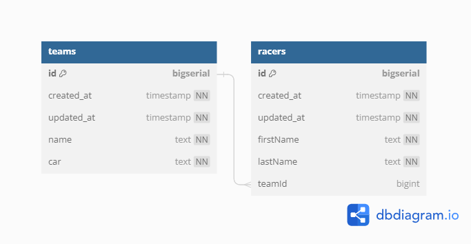

# F1

The F1 API provides endpoints for managing F1 teams, and racers.

## Database Schema



## Getting Started

To get started with using the Formula 1, follow the steps below:

### Prerequisites

- Go programming language installed on your system.
- PostgreSQL database installed and running.

### Installation

1. Clone the repository:

   ```
   git clone <repository-url>
   ```

2. Install dependencies:

   ```
   go mod tidy
   ```

3. Build the project:

   ```
   go build
   ```

### Configuration

The API can be configured using environment variables or command-line flags. Available configurations are:

- `PORT`: Port on which the server will listen. Default is `8081`.
- `ENV`: Environment mode (`development`, `staging`, or `production`). Default is `development`.
- `DB_DSN`: PostgreSQL database connection string.

### Running the Server

Run the server using the following command:

```
go run .
```

## API Endpoints

The following endpoints are available in the API:

### Users

- `GET /api/v1/racers`: Create racer.
- `GET /api/v1/racers/{racerId}`: Get a racer by ID.
- `PUT /api/v1/racers/{racerId}`: Update a racer by ID.
- `DELETE /api/v1/racers/{racerId}`: Delete a racer by ID.

### Posts

- `POST /api/v1/teams`: Create a new team.
- `GET /api/v1/teams/{teamId}`: Get a team by ID.
- `PUT /api/v1/teams/{teamId}`: Update a team by ID.
- `DELETE /api/v1/teams/{teamId}`: Delete a team by ID.


## Error Handling

The API follows standard HTTP status codes for indicating the success or failure of a request. Error responses include appropriate error messages to help troubleshoot issues.

## Authentication

Authentication is not implemented in this version of the API. All endpoints are accessible without authentication.


## DB structure

```
Table teams {
    id bigserial [primary key]
    created_at timestamp [not null, default: `now()`]
    updated_at timestamp [not null, default: `now()`]
    name text [not null]
    car text [not null]
}

Table racers {
    id bigserial [primary key]
    created_at timestamp [not null, default: `now()`]
    updated_at timestamp [not null, default: `now()`]
    firstName text [not null]
    lastName text [not null]
    teamId bigint [ref: > teams.id]
}

```